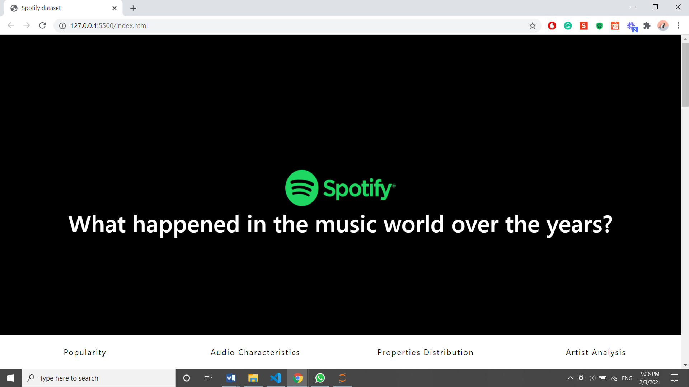
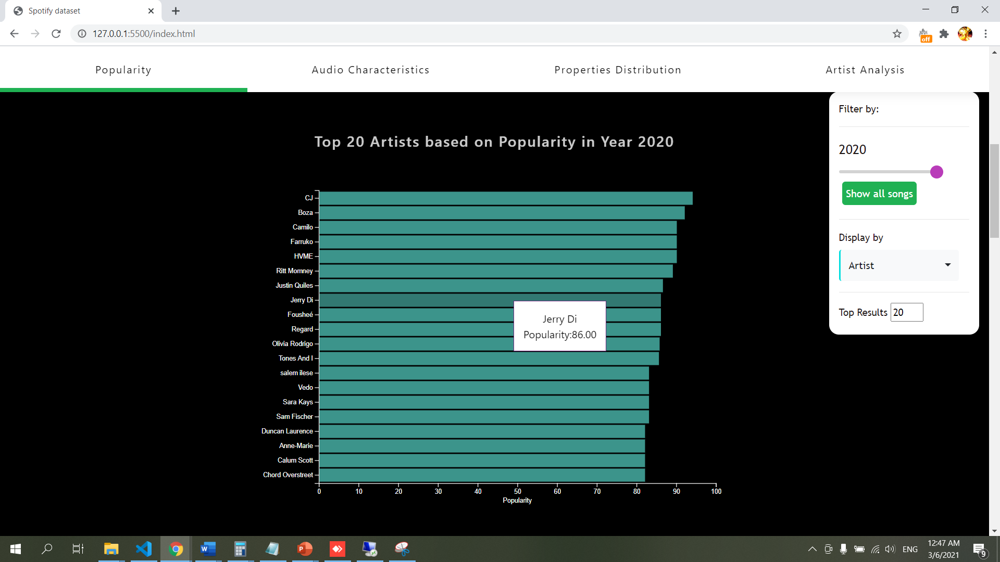
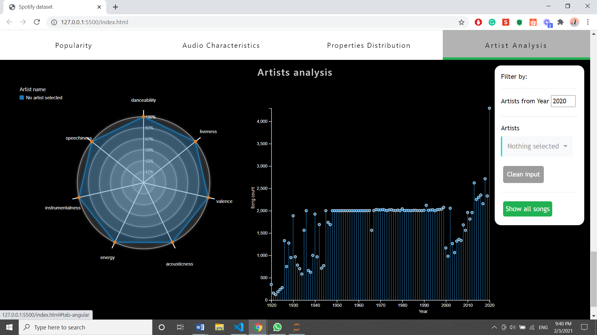

# What happened in the music world over the years?
This is a data visualization project entitled "What happened in the music world over the years?".

The purpose of this project is to demonstrate the used of D3 in data visualization.

The dataset is obtained via https://www.kaggle.com/yamaerenay/spotify-dataset-19212020-160k-tracks.

## Brief description
Since all of our team members are avid fans of music, we are delighted to perform analysis and visualization on the music data provided by Spotify from the year 1921 to 2020 and find interesting insights from our favourite artists. 

## Screenshots of application

## Notes
You have to run the index.html by setting up your own server, it can be either a localhost or any hosting service like heroku.
If you are facing any issue, do create an issue and I will look at it. Thanks.
